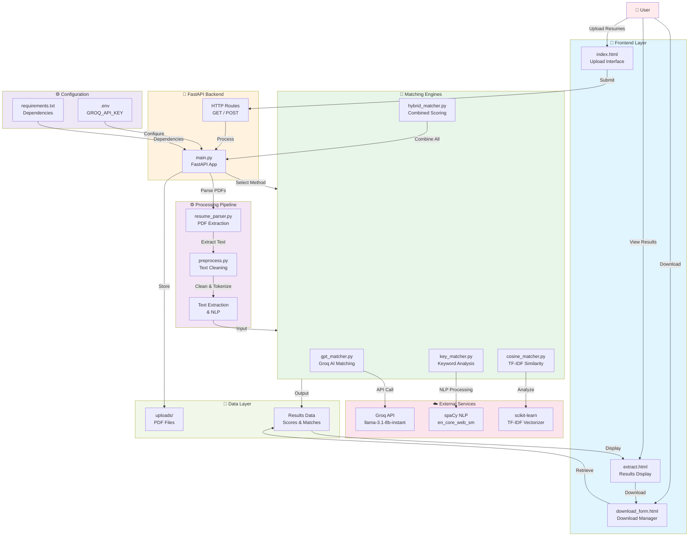

# 🏗️ AI Resume Matcher - Architecture Diagram

## System Architecture



---

## 📋 Component Description

### **Frontend Layer**
- **index.html**: Upload resumes and job descriptions
- **extract.html**: Display matching results and scores
- **download_form.html**: Download selected resumes

### **FastAPI Backend**
- **main.py**: Core application logic and request handling
- **Routes**: REST API endpoints

### **Processing Pipeline**
- **resume_parser.py**: Extract text from PDF files using PyMuPDF
- **preprocess.py**: Clean and normalize text data
- **NLP Processing**: Tokenization and text preparation

### **Matching Engines** (Choose one or hybrid)
1. **GPT Matcher**: AI-powered scoring via Groq API
2. **Cosine Matcher**: TF-IDF vectorization and similarity
3. **Keyword Matcher**: Pattern and keyword matching
4. **Hybrid Matcher**: Weighted combination of all methods

### **External Services**
- **Groq API**: Fast AI inference (llama-3.1-8b-instant)
- **spaCy**: Natural language processing
- **scikit-learn**: Machine learning and text vectorization

### **Storage**
- **uploads/**: Temporary PDF storage
- **Results Data**: Matching scores and analysis

---

## 🔄 Data Flow

```
User → Upload Resumes → Parser → Preprocess → NLP
   ↓
Select Algorithm → Matcher → External Service → Scoring
   ↓
Results → Display → Download
```

---

## ⚙️ Configuration

- `.env`: Store sensitive API keys (GROQ_API_KEY)
- `requirements.txt`: Python dependencies
- `Procfile`: Deployment configuration


