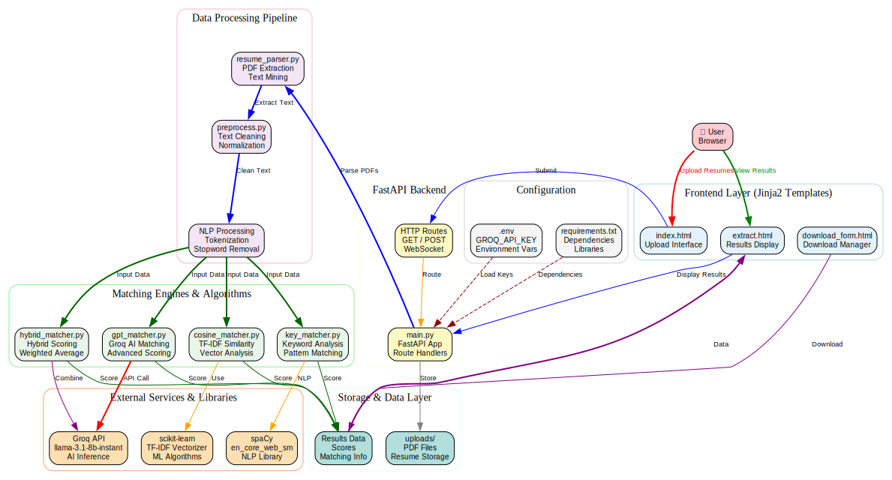

# 🤖 Resume Matcher

A FastAPI-based web application that automatically evaluates and scores resumes (PDFs) against a provided job description using multiple matching methods: Groq AI, cosine similarity, keyword matching, and a custom hybrid algorithm.

---

## 🚀 Features

- 📤 Upload multiple PDF resumes
- 📝 Upload or paste a job description
- 🧠 Select matching method: `gpt`, `cosine`, `keyword`, or `hybrid`
- 📊 View similarity scores with detailed explanations
- 📁 Download top N matching resumes as a ZIP
- 📌 Boost scores for candidates meeting experience requirements
- ⚡ Fast AI-powered resume evaluation using Groq

---

## 🧠 Matching Algorithms

- **GPT Match (Groq)**: Uses Groq's Llama 3.1 AI to intelligently score resumes against job descriptions
- **Cosine Match**: Uses TF-IDF & cosine similarity for statistical matching
- **Keyword Match**: Basic keyword overlap analysis
- **Hybrid Match**: Weighted combination of all above methods + experience verification

---

## 🏗️ Architecture Diagram



---

## 🛠️ Tech Stack

- **Backend**: FastAPI (Python)
- **Frontend**: Jinja2 Templates (HTML/CSS)
- **PDF Parsing**: PyMuPDF (fitz)
- **Text Processing**: spaCy NLP
- **Similarity Analysis**: scikit-learn, sentence-transformers
- **AI/LLM**: Groq API (Llama 3.1 8B Instant)
- **Package Manager**: npm, pip

---

## 📂 Project Structure

```
Resume-matcher-main/
├── app/
│   ├── main.py              # FastAPI application entry point
│   ├── resume_parser.py     # PDF resume extraction
│   ├── preprocess.py        # Text preprocessing
│   ├── gpt_matcher.py       # Groq AI matching
│   ├── cosine_matcher.py    # TF-IDF cosine similarity
│   ├── key_matcher.py       # Keyword matching
│   ├── hybrid_matcher.py    # Hybrid algorithm
│   └── templates/           # HTML templates
│       ├── index.html       # Main page
│       ├── extract.html     # Results page
│       └── download_form.html
├── requirements.txt         # Python dependencies
├── package.json            # Node.js dependencies
├── .env                    # Environment variables
└── README.md
```

---

## 📋 Requirements

### Prerequisites
- Python 3.11 or higher
- Node.js (for npm packages)
- Groq API Key (free at https://console.groq.com)
- Internet connection

### Python Dependencies
- fastapi
- uvicorn
- jinja2
- python-multipart
- PyMuPDF
- python-dotenv
- requests
- scikit-learn
- docx2txt
- sentence-transformers
- spacy
- openai (for future OpenAI integration)

### Node.js Dependencies
- express

---

## 🚀 Quick Start

### 1. Clone the Repository
```bash
git clone https://github.com/yourusername/Resume-matcher.git
cd Resume-matcher-main
```

### 2. Create Python Virtual Environment
```bash
python3.11 -m venv .venv
source .venv/bin/activate  # On Windows: .venv\\Scripts\\activate
```

### 3. Install Python Dependencies
```bash
pip install -r requirements.txt
```

### 4. Download Spacy Model
```bash
python -m spacy download en_core_web_sm
```

### 5. Install Node.js Dependencies
```bash
npm install
```

### 6. Setup Environment Variables
```bash
# Create .env file
cp .env.example .env

# Edit .env and add your Groq API key:
# GROQ_API_KEY=your_groq_api_key_here
```

**Get your Groq API Key:**
1. Visit https://console.groq.com
2. Sign up (free)
3. Create an API key
4. Copy and paste into .env file

### 7. Run the Application
```bash
python -m uvicorn app.main:app --reload --host 0.0.0.0 --port 8000
```

### 8. Access the Application
```
http://localhost:8000
```

---

## 💻 Usage

1. **Upload Resumes**: Click "Choose Files" and select PDF resumes
2. **Enter Job Description**: Paste or upload a job description
3. **Select Matching Method**:
   - `gpt`: AI-powered (recommended, requires Groq API key)
   - `cosine`: Statistical similarity
   - `keyword`: Simple keyword matching
   - `hybrid`: Combination of all methods
4. **View Results**: See scores and detailed explanations
5. **Download**: Get top matching resumes as ZIP

---

## 🔧 Configuration

### Environment Variables (.env)
```dotenv
GROQ_API_KEY=your_groq_api_key_here
```

### API Endpoints

- `GET /` - Main page
- `POST /match` - Match resumes against job description
- `GET /download` - Download matched resumes as ZIP

---

## 🤖 Groq API Setup

This project uses **Groq API** for fast, free AI-powered resume matching:

### Why Groq?
- ✅ **Free to use** with generous quota
- ✅ **Super fast** inference (10x faster than OpenAI)
- ✅ **High quality** responses
- ✅ **No credit card** required

### Getting Your API Key
1. Go to https://console.groq.com
2. Create a free account
3. Navigate to API Keys
4. Generate a new API key
5. Copy and paste into `.env` file

### Available Models
- `llama-3.1-8b-instant` (used by default) - Fast and accurate
- Other models available: Check Groq console for latest options

---

## 📊 Scoring Breakdown

When using GPT matching (Groq), you get:
- **Total Score**: Overall match percentage (0-100)
- **Skills Match**: How well skills align
- **Experience Match**: Years of experience alignment
- **Education Match**: Relevant education/degrees
- **Keyword Match**: Job-specific term coverage
- **Reason**: Detailed explanation of the score

---

## 🐛 Troubleshooting

### Port 8000 Already in Use
```bash
python -m uvicorn app.main:app --reload --port 8001
```

### Spacy Model Not Found
```bash
python -m spacy download en_core_web_sm
```

### Groq API Key Not Working
1. Verify key is correctly copied (no extra spaces)
2. Check .env file is in project root
3. Restart the server
4. Visit https://console.groq.com to verify key is active

### PDF Upload Issues
- Ensure PDF is valid and not corrupted
- Try uploading a smaller file first
- Check file permissions

---

## 📈 Future Enhancements

- [ ] Support for DOCX format resumes
- [ ] Batch processing for large resume datasets
- [ ] Database integration for storing results
- [ ] User authentication and profiles
- [ ] Advanced filtering and sorting
- [ ] API endpoint for programmatic access
- [ ] Docker containerization
- [ ] Deployment to cloud platforms

---

## 📜 License

ISC License - Feel free to use this project for your own purposes.

---

## 🤝 Contributing

Contributions are welcome! Feel free to:
1. Fork the repository
2. Create a feature branch
3. Submit a pull request

---

## 📧 Support

For issues, questions, or suggestions, please open an issue on GitHub.

---

## 🎓 Learn More

- [FastAPI Documentation](https://fastapi.tiangolo.com/)
- [Groq API Docs](https://console.groq.com/docs)
- [PyMuPDF Documentation](https://pymupdf.readthedocs.io/)
- [spaCy Documentation](https://spacy.io/)

---

**Made with ❤️ using FastAPI and Groq AI**

